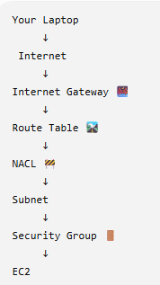
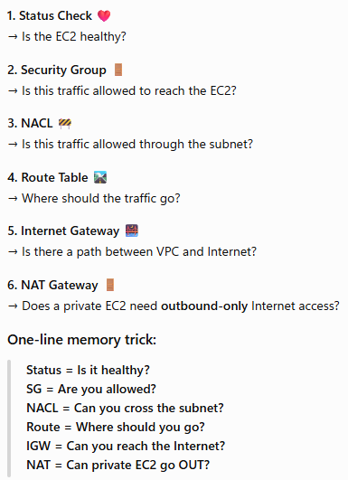

"An EC2 instance is unreachable. How would you troubleshoot it?"

Give this sequence:

1. Identify the type of connectivity failure
        ↓
2. Check EC2 2/2 status checks
        ↓
3. Check Security Group inbound/outbound
        ↓
4. Check NACL inbound/outbound
        ↓
5. Check subnet and route table
        ↓
6. Check Internet Gateway / NAT / VPN path
        ↓
7. Check public/private IP and ENI
        ↓
8. Check OS firewall
        ↓
9. Check SSH/RDP service
        ↓
10. Check application and listening port

  

The key AWS concepts to remember
Security Group
Stateful, instance/ENI level, allow rules.

NACL
Stateless, subnet level, allow and deny rules, both directions matter.

Route Table
Determines where traffic goes.

Internet Gateway
Enables Internet connectivity for resources with appropriate public addressing/routes.

NAT Gateway
Allows private resources to initiate outbound Internet connections; it doesn't provide unsolicited inbound access.

EC2 Status Checks
Tell you whether AWS infrastructure and the instance itself are healthy.