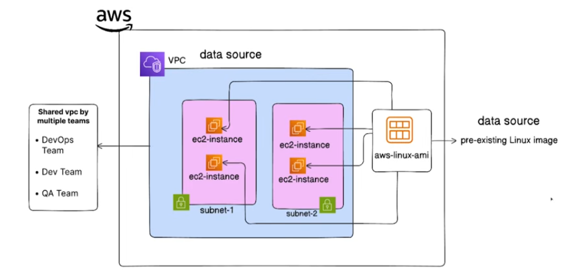

Terraform dataSource: here we neeed to create an EC2 instance in already existing VPC and Subnets
so we use the data sources through which we can able to create and ec2 instances in the existing VPC and Subnet by providing the VPC&Subnet info --->  adding filter Name Or ID 